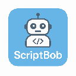

# ScriptBob

ScriptBob is a Chrome DevTools extension that allows you to edit the HTML of any website using natural language commands. Powered by AI, it lets you manipulate DOM elements without writing code manually.

## Features

- **Natural Language Editing**: Type what you want to change in plain English (e.g., "delete all spans under class .sc-keuYuY.fpjkiy" or "mockup a footer")
- **AI-Powered Changes**: Uses your preferred LLM API to generate the JavaScript needed to make your requested changes
- **Multiple LLM Support**: Works with OpenAI, Anthropic, or any custom LLM API that follows a similar format
- **Interactive Chat Interface**: Simple chat UI where you can give commands and see results
- **Review Before Execute**: See the generated JavaScript before running it on the page
- **Secure**: Your API keys are stored locally and never sent to any server except the LLM provider you specify

## Installation

### From Chrome Web Store (not live yet)

1. Visit the [Chrome Web Store](https://chrome.google.com/webstore) and search for "ScriptBob"
2. Click "Add to Chrome"
3. Confirm the installation

### Manual Installation (Developer Mode)

1. Clone this repository or download the ZIP file and extract it
2. Open Chrome and navigate to `chrome://extensions/`
3. Enable "Developer mode" in the top-right corner
4. Click "Load unpacked" and select the folder containing the extension files
5. The extension should now appear in your browser toolbar and in DevTools

## Usage

1. Open DevTools in Chrome (F12 or Ctrl+Shift+I)
2. Navigate to the "ScriptBob" panel
3. Click the ⚙️ Settings button to configure your LLM API provider:
   - Select your API provider (OpenAI, Anthropic, or Custom)
   - Enter your API key
   - Configure the endpoint URL and model if necessary
   - Click "Save Settings"
4. Type your natural language editing command in the input field
5. Press Enter or click the Send button
6. Review the generated JavaScript code
7. Click "Execute Code" to apply the changes to the current page

## Example Commands

- "Delete all ads on this page"
- "Change the background color of the header to light blue"
- "Add a 'Back to Top' button at the bottom right corner"
- "Make all paragraphs use the font 'Arial' with size 16px"
- "Create a sticky navbar from the existing navigation"
- "Replace all images with placeholders"
- "Fix the responsive layout on mobile view"

## Privacy & Security

- Your API keys are stored in Chrome's secure storage and are only sent to the LLM provider you specify
- No data is collected or sent to any servers owned by ScriptBob
- All operations happen locally in your browser

## Contributing

Contributions are welcome! Please feel free to submit a Pull Request.

1. Fork the repository
2. Create your feature branch (`git checkout -b feature/amazing-feature`)
3. Commit your changes (`git commit -m 'Add some amazing feature'`)
4. Push to the branch (`git push origin feature/amazing-feature`)
5. Open a Pull Request

## License

Distributed under the MIT License. See `LICENSE` for more information.

## Contact

Project Link: [https://github.com/yourusername/script-bob](https://github.com/yourusername/script-bob)

---

Made by Keenan Bruni
